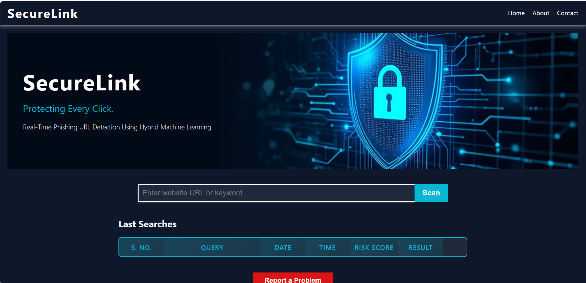
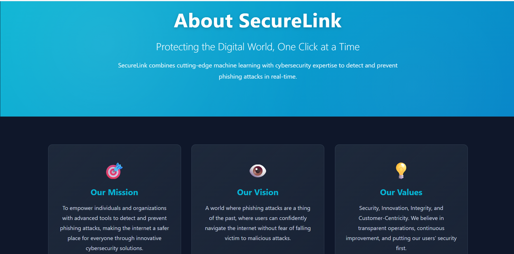
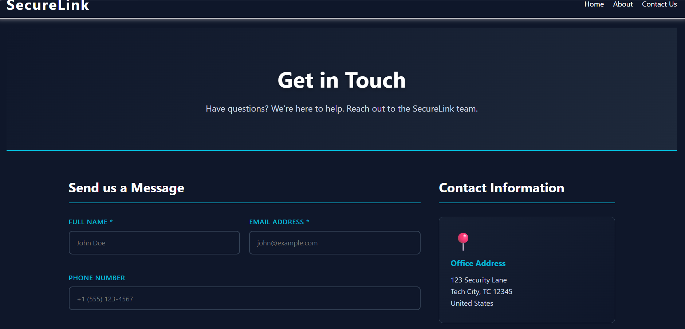
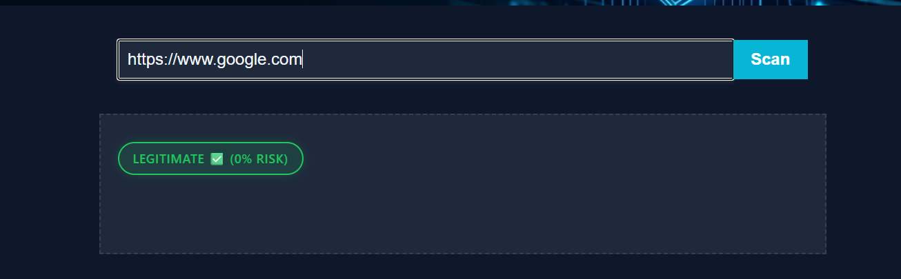
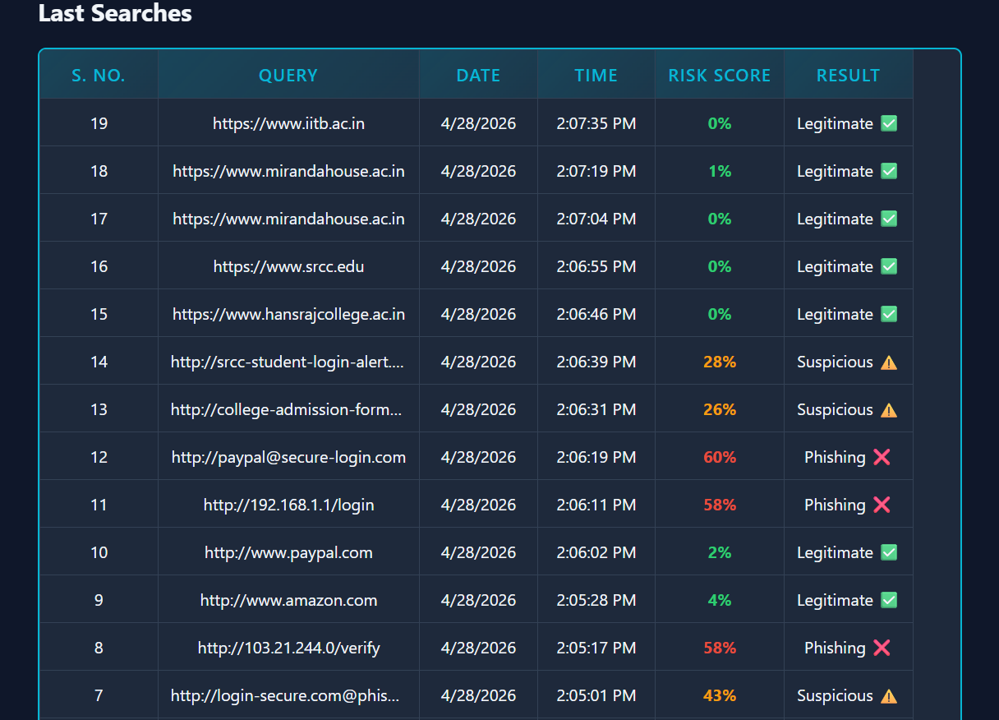

# 🔐 Phishing Detection System (ML + Security Intelligence)


---

## 🚀 Overview

This project is a **Machine Learning based phishing detection system** that analyzes URLs and classifies them into:

* ✅ Legitimate
* ⚠️ Suspicious
* ❌ Phishing

It combines **ML models + rule-based intelligence** to provide accurate real-time detection.

---

## 🧠 Key Features

✔ Real-time URL scanning
✔ Risk score (0–100%)
✔ ML-based detection (RandomForest, XGBoost, SVM, Logistic Regression)
✔ Ensemble model for high accuracy
✔ Rule-based detection (IP, keywords, URL length, symbols)
✔ Trusted domain detection (Google, SBI, GitHub, etc.)
✔ Short URL expansion (bit.ly, tinyurl)
✔ Detection history tracking
✔ Fast API response

---

## 🏗️ Tech Stack

* **Backend:** Python, Flask
* **ML Models:** Scikit-learn, XGBoost
* **Data Handling:** Pandas, NumPy
* **Frontend:** HTML, CSS, JavaScript

---

## 📁 Project Structure

```
phishing-detection/
│
├── app.py
├── real_dataset.csv
├── model/
├── utils/
│   └── feature_extraction.py
├── templates/
├── static/
├── training/
│   └── train_models.py
├── screenshots/
└── README.md
```

---

## ⚙️ Installation & Setup

```bash
git clone https://github.com/ParulGautam2706/Phishing-Detection-System.git
cd phishing-detection
pip install -r requirements.txt
```

---

## ▶️ Run the Project

```bash
python app.py
```

Open in browser:

```
http://127.0.0.1:5000
```

---

## 🧪 Test Examples

| URL                                 | Expected Result |
| ------------------------------------| --------------- |
| https://www.google.com              | Legitimate      |
| http://facebook-security-warning.net| Suspicious      |
| http://goog1e-verify-account.com    | Phishing        |

---

## 📊 Model Performance

* Accuracy: ~95%
* F1 Score: ~0.94
* Ensemble model used for best performance

---

## 📸 Screenshots

### 🏠 Home Page


###  About Page


### 📞 Contact Page


### 📊 Detection Result


### 📋 History Table


---

## 🔐 Security Insights Used

* URL length analysis
* IP-based detection
* Suspicious keywords (login, verify, bank)
* Special symbols (@, -)
* Domain trust validation

---

## 🌟 Future Improvements

* Deep Learning model (LSTM)
* Browser Extension
* Live phishing API integration
* WHOIS & SSL verification
* User authentication system

---

## 👩‍💻 Author

**Santosh Gautam**
🔗 GitHub: https://github.com/ParulGautam2706
---
**Siya Rana**
🔗 GitHub: https://github.com/Siya-rana015
---
**Kartik Sharma**
🔗 GitHub: https://github.com/Kartik-vats01
---

## ⭐ Support

If you like this project, please ⭐ the repository!
